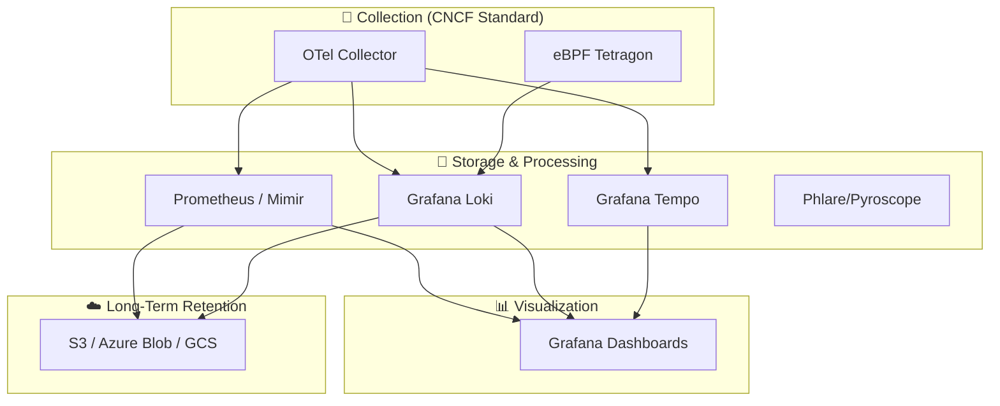

# Observability & Monitoring : Industrial LGTM Stack
> **Architecture :** Lab d'Observabilité Industrielle (LGTM & OpenTelemetry) | **Version :** v2.1 | **Maintainer :** [Ravindra JOB](https://github.com/ravindrajob/)
---

Cette plateforme constitue un centre d'excellence pour l'observabilité moderne. Elle s'appuie sur la **LGTM Stack** (Loki, Grafana, Tempo, Mimir/Prometheus) et le standard **OpenTelemetry** pour fournir une visibilité à 360° sur les infrastructures Cloud Native.

L'architecture est conforme aux principes de la **CNCF** et du **Cloud Adoption Framework (CAF)**, garantissant une scalabilité horizontale et un stockage long-terme des métriques et logs.

---

### 🧱 Architecture de la Plateforme

L'infrastructure utilise une approche **"Collector-First"** via OpenTelemetry, permettant de décorréler la collecte de données du backend de stockage.

---

### 🚀 Les 4 Piliers de l'Observabilité 2.0

| Pilier | Composant | Rôle Technique |
| :--- | :--- | :--- |
| **Metrics** | Prometheus / Mimir | Collecte multidimensionnelle et stockage TSDB haute performance. |
| **Logs** | Grafana Loki | Agrégation de logs optimisée pour les coûts (indexation de labels uniquement). |
| **Traces** | Grafana Tempo | Traçage distribué à l'échelle pour le debug de microservices complexes. |
| **Security** | eBPF (Tetragon) | Observabilité de sécurité en temps réel (Kernel-level monitoring). |

---

### 🛡️ Hardening & Gouvernance (Security by Design)

- **Observabilité Déportée :** Conformément aux standards SRE, cette stack est conçue pour être déployée dans un projet/compte **Security & Monitoring** isolé, évitant les Single Points of Failure (SPOF).
- **Zéro Trust Identity :** Authentification via Managed Identities et RBAC granulaire sur les Data Sources Grafana.
- **FinOps Optimized :** Configuration de la rétention différenciée (ex: 15 jours pour les logs de debug, 1 an pour les logs d'audit sur S3 chiffré).

### ⚙️ Déploiement

Cette plateforme propose deux modes d'implémentation :
1.  **Lab Edition (`docker-compose-lab/`)** : Pour les tests rapides et les environnements de démonstration locaux.
2.  **Industrial Edition (`kubernetes-operator/`)** : Déploiement via Helm et Operators pour une mise en production sur AKS, GKE ou EKS.

---
*Cette infrastructure reflète une approche standardisée et sécurisée de l'observabilité Cloud Native.*

**Adoption industrialisée du CAF avec surcouche de sécurité et intégration des pratiques CNCF.**
